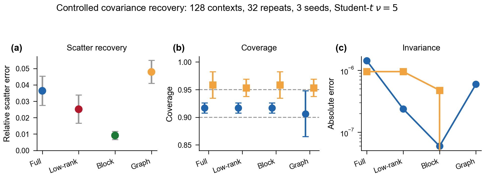
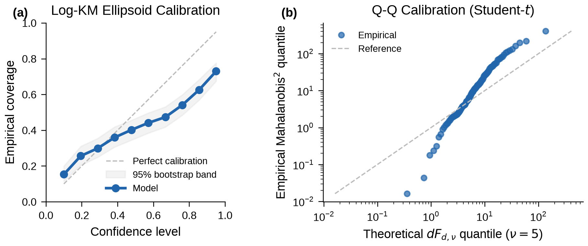
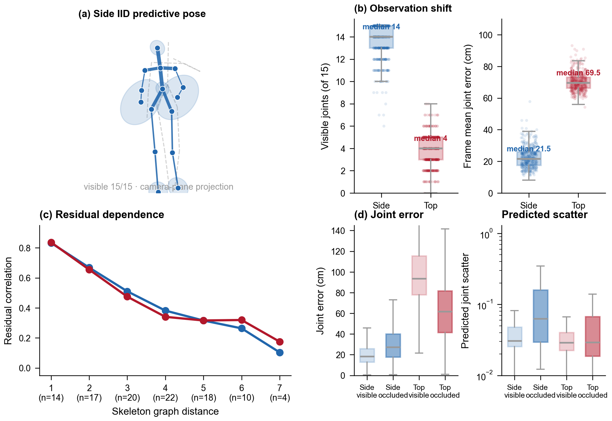

<h1 align="center">General Equivariant Covariance Networks</h1>

<p align="center">
  <strong>From typed structured-output declarations to verified predictive distributions</strong>
</p>

<hr>

<p align="center">
  面向结构化不确定性预测的等变编译器：把表示、协方差族、概率律与执行 lowering 统一到可检查的语义合同中。
</p>

<p align="center">
  <a href="./LICENSE"></a>
  <a href=".github/workflows/ci.yml"></a>
  <a href="#benchmark-contract"></a>
  <a href="#scope-and-status"></a>
</p>

## Project in one minute

> Typed compilation of equivariant structured-output predictors with explicit SPD covariance, predictive-law, and statistical adequacy contracts.

本项目的核心不是一个针对单一数据集的 uncertainty head，而是一条从结构化输出声明到 predictive distribution 的 typed compilation path：编译器负责表示可达性、协方差结构、SPD 参数化和 exact lowering；实验再独立检验 likelihood、coverage、proper scores 与形状相关的 calibration diagnostics。

## Scientific story / 科学主线

The project develops the following evidence chain:

```text
structured output declaration
        |
        v
representation decomposition + reachability
        |
        v
typed operator family + SPD lowering
        |
        v
predictive law (Gaussian / Student-t / conditional radial law)
        |
        v
semantic validity  <---->  statistical adequacy audit
```

The compiler therefore separates two questions that are often conflated:

1. **Is the compiled object valid?**  Does it have the requested representation, preserve the declared equivariance, remain SPD, and execute the registered lowering exactly?
2. **Is the predictive law adequate?**  Does the learned distribution match the residual geometry, radial behavior, directional dependence, and observation shift seen in held-out data?

The current journal direction treats predictive-law selection as part of the typed contract. In particular, a conditional Student-t radial law adds an invariant scalar field for the degrees of freedom without changing the equivariant mean or SPD scatter construction. This makes diagnosis-driven law adaptation a compiler extension rather than an experiment-specific post-processing step.

## Capability overview / 能力概览

| Area | Capability | Contract recorded |
| --- | --- | --- |
| Structured outputs | Symmetric rank-2 and higher-order tensor declarations, Cartesian symmetry formulas, graph-structured repeated outputs | output representation and active target |
| Representation compilation | Irrep decomposition, parity checks, multiplicity accounting, target-pruned reachability, shortest CG plans | reachability and representation certificate |
| Covariance families | Full, isotypic/block, low-rank, centered spectral-window, and graph-precision families | canonical vs. active target and parameter budget |
| Positive-definite maps | Matrix-exponential and spectral SPD constructions; graph precision assembly | SPD effect and numerical validity |
| Predictive laws | Gaussian, Student-t, conditional-t, and exact finite-mixture contracts | normalized density, moments, sampling, diagnostics |
| Lowering | Spherical-CG and Cartesian/STF execution paths with explicit fidelity | backend, exactness, and checkpoint mapping |
| Statistical audit | Proper NLL, Energy Score, coverage, MACE, radial PIT, whitening defects, directional tests, risk--coverage | split, law, and diagnostic provenance |

The compiler emits an executable readout together with a machine-readable compilation report. The report records the selected family, representation, active coordinates, lowering fidelity, complexity, and the scope of the soundness claim.

## Selected figures / 代表性图示

These compact figures are included as a visual entry point to the scientific story. They show compiler-level recovery, shape-sensitive calibration auditing, and structured-output behavior under observation shift.

<p align="center">
  
</p>

<p align="center"><em>Compiler-level covariance recovery, coverage, and orthogonal-coordinate invariance.</em></p>

<p align="center">
  
</p>

<p align="center"><em>Predictive calibration is audited separately from SPD and equivariance validity.</em></p>

<p align="center">
  
</p>

<p align="center"><em>Structured pose uncertainty, observation shift, residual dependence, and predicted scatter diagnostics.</em></p>

## Scope and status / 范围与状态

- The semantic contract is group-agnostic for finite-dimensional orthogonal output representations.
- The currently validated executable backend targets orthonormal `O(3)` contracts using real e3nn-compatible layouts.
- A group-agnostic semantic IR does not imply that a numerical backend for every compact orthogonal group is shipped.
- Soundness is compositional relative to registered typed primitives, representation/decomposition oracles, and registered lowering rules.
- The certificate is **not** a formal verification of arbitrary user code, a completeness theorem for all equivariant SPD programs, or a guarantee of calibration or physical uncertainty identification.
- Dataset payloads, checkpoints, and large run artifacts are external to the source tree. Reproducibility is defined by the benchmark contract and recorded run manifests, not by committing private data.

The repository is an active research implementation. Interfaces and experiment records may evolve while the manuscript and benchmark protocol are being consolidated.

For the normative mathematical boundary, see [`mathematical_contract.md`](mathematical_contract.md). For the exact scope of compiler certificates, see [`docs/compiler_certificate_scope.md`](docs/compiler_certificate_scope.md).

## Benchmark Contract / 基准协议

Every headline benchmark must record the following before its result is used in the manuscript:

1. **Fixed identity.** Dataset version, split identity, model seed, protocol seed, feature/checkpoint provenance, output declaration, family, law, and lowering backend are recorded together.
2. **Selection boundary.** Training and validation may select checkpoints and declared hyperparameters. Test and OOD views are evaluation-only and never participate in early stopping, tuning, or model selection.
3. **Matched comparisons.** A causal comparison changes one declared factor at a time whenever the experiment is described as an ablation or control.
4. **Proper scores first.** Normalized NLL and Energy Score are reported with calibration summaries; a single coverage number is never treated as sufficient evidence of adequacy.
5. **Shape-sensitive diagnostics.** Where applicable, reports include radial PIT, whitened second-moment defect, radius--direction dependence, uncertainty/error alignment, and irrep- or component-aware diagnostics.
6. **Validity gates.** Predictions must be finite; covariance or precision objects must pass the relevant SPD checks; equivariance and exact-lowering regression tests must remain green.
7. **Negative evidence is retained.** A failed law, family, representation, or control is recorded as a result and is not removed because it is inconvenient for the headline narrative.

The benchmark contract is deliberately stronger than “the model trains.” It makes the distinction between compiler validity, predictive-law adequacy, and downstream task utility auditable.

## Repository map / 仓库结构

| Path | Role |
| --- | --- |
| `equivcompiler/` | Declarative API, typed specifications, policies, planning, and checkpoint contracts |
| `representations/` | Representation decomposition, reachability, operator IR, and lowering |
| `spd_maps/` | Full, block, low-rank, spectral, and graph-precision SPD maps |
| `distributions/` | Gaussian, Student-t, conditional-t, and mixture likelihood components |
| `models/` | Equivariant backbones and structured predictive readouts |
| `data/` | Dataset interfaces and frozen feature/data contracts |
| `evaluation/` | Proper scores, calibration, risk--coverage, sampling, and audit metrics |
| `scripts/` | Reproducible training, audit, compilation, and benchmark entry points |
| `tests/` | Compiler, equivariance, SPD, distribution, lowering, and data-contract tests |
| `docs/` | Mathematical contracts, certificate scope, evidence ledgers, and protocol notes |

## Checks / 检查

The maintained CPU gate is intentionally lightweight and reproducible on a clean checkout:

```bash
python -m ruff check .
python -m pytest tests -q -W error
```

The same commands are executed by GitHub Actions on pushes to `main` and on pull requests. CUDA, cuEquivariance, and fused-kernel checks are dependency- or device-gated; when they are run, their environment and benchmark contract are recorded separately rather than silently treated as CPU equivalence.

For local development, use the project environment rather than Conda `base`:

```powershell
conda activate EGNN
python -m pip install -r requirements.txt
python -m pip install -e . --no-deps
```

The server training environment and private dataset locations are intentionally not required for the CPU contract. Dataset roots should be supplied through the project data configuration rather than committed into source files.

## Minimal API shape

The public-facing conceptual API is declarative: the output structure, covariance family, fidelity, and predictive law are inputs to compilation.

```python
from equivcompiler import ExactOnly, FullCovariance, compile_predictor

model, report = compile_predictor(
    backbone,
    output="ij=ji",
    covariance=FullCovariance(),
    fidelity=ExactOnly(),
    distribution="student_t",
)
```

The returned report is part of the result, not an optional debug log. It is the place to inspect representation reachability, active coordinates, SPD semantics, execution fidelity, and the explicit non-claims of the compilation.

## Data, checkpoints, and release boundary

Large datasets, trained checkpoints, generated figures, and run artifacts are not part of the source distribution. They should be obtained through the project-specific research workflow and matched to the run manifest before use. Do not commit private data, credentials, or generated model artifacts to the repository.

The source tree is organized so that compiler and metric tests can run without the full scientific data payload. This keeps the correctness contract reviewable while allowing the research benchmarks to remain separately managed.

## Citation

The manuscript citation will be added here together with the archival version and released code tag when the research record is public. Until then, please cite the project using the repository metadata and the associated manuscript record supplied by the authors.

## License / 许可证

This project is licensed under the Apache License 2.0. See [`LICENSE`](LICENSE) for the complete text.
